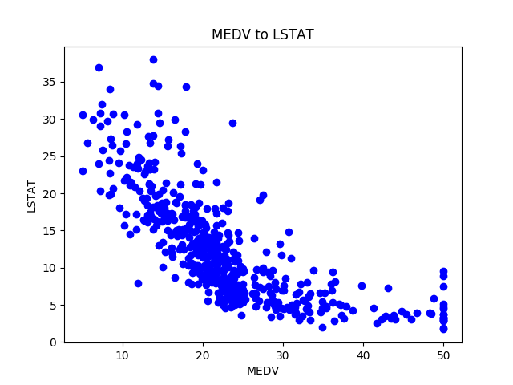

# CEBD1160 Introduction to Big Data Technology (Concordia University)

Instructions and template for final projects.

| Name             | Date      |
|:-----------------|:----------|
|Ngoc-Thong Nguyen | 2019-06-15|

-----

### Resources

This repository includes the following:

- Python script for the analysis
- Results figure/saved file
- Dockerfile for the experiment
- runtime-instructions in a file named RUNME.md

-----

## Research Question

What features can be correlated to predict the price of the house ?

### Abstract

We have a dataset of information about 14 features of homes from Boston, collected in 1978. 
We could use this dataset to find out what features can be correlated to predict the price of the house.
We will use the Python's sklearn library of machine learning and matplotlib to answer this question.
We will produce the following scatter graphs:
- all the features vs the MEDV (median value of owner-occupied home in $1000);
- difference between houses' real value and predicted value.

### Introduction

The dataset used in this project comes from the UCI Machine Learning Repository that was collected in 1978 and each of the 506 entries represents aggregate information about 14 features of homes from various suburbs located in Boston. We're loading the already prepared dataset from the sklearn library. 
(Ref. [1])

### Methods

- For each feature in the dataset, plot a scatter graph vs MEDV.
- Find which features are correlated with MEDV.
- Create a new dataset with the correlated features.
- Split the correlated dataset into train and test.
- Train a linear regression with lasso.
- Predict the results.
- Plot the residuals: difference between real and predicted.

We choose this method because it's simple and the lasso regression estimator is recommended by following the machine learning map from scikit-learn (ref. [8]).

### Results

There's a correlation between MEDV and these two features: 
- RM (number of rooms): houses with more rooms will worth more.
- LSTAT (percentage lower status of the population): neighborhoods with more lower class workers will worth less.

### Discussion

The dataset considered is quite limited, there are a lot of features, like the size of the house in square feet, the presence of pool or not, and others, that are very relevant when considering a house price.

Given the high variance on the residuals, we can assume that it is not a robust model and, therefore, not appropriate for making predictions.
(Ref. [1])

### References

[1] TOWARDSDATASCIENCE.COM, Machine Learning Project: Predicting Boston House Prices With Regression, https://towardsdatascience.com/machine-learning-project-predicting-boston-house-prices-with-regression-b4e47493633d, site visited on June 15, 2019.

[2] TOWARDSDATASCIENCE.COM, Linear Regression on Boston Housing Dataset, https://towardsdatascience.com/linear-regression-on-boston-housing-dataset-f409b7e4a155, site visited on June 15, 2019.

[3] RITCHIENG.COM, Boston Home Prices Prediction and Evaluation, https://www.ritchieng.com/machine-learning-project-boston-home-prices/, site visited on June 15, 2019.

[4] KAGGLE.COM, Predicting Boston House Prices, https://www.kaggle.com/sagarnildass/predicting-boston-house-prices, site visited on June 15, 2019.

[5] OLEGLEYZ.GITHUB.IO, Model Evaluation and Validation: Predicting Boston Housing Prices, https://olegleyz.github.io/boston_housing.html, site visited on June 15, 2019.

[6] KITMARKS.COM, Project: Predicting Boston Housing Prices, http://kitmarks.com/boston_housing.html, site visited on June 15, 2019.

[7] NEURAL.CZ, Dataset exploration: Boston house pricing, http://www.neural.cz/dataset-exploration-boston-house-pricing.html, site visited on June 15, 2019.

[8] SCIKIT-LEARN.ORG, Choosing the right estimator, https://scikit-learn.org/stable/tutorial/machine_learning_map/index.html, site visited on June 15, 2019.

-------
